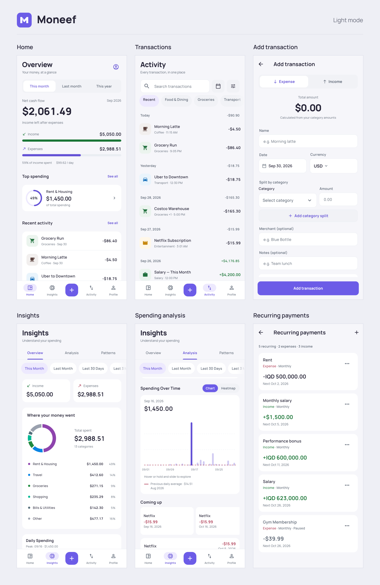

<h1 align="center">
  <br>
  Moneef
</h1>

<p align="center">
  Track income, expenses, and recurring payments on your Android phone.
</p>

<p align="center">
  <a href="https://github.com/Ali-932/moneef/actions/workflows/ci.yml"></a>
  
  <a href="LICENSE"></a>
</p>

<p align="center">
  <a href="#download">Download</a> •
  <a href="#features">Features</a> •
  <a href="#privacy">Privacy</a> •
  <a href="#architecture">Architecture</a> •
  <a href="#license">License</a>
</p>

Moneef is a deliberately minimal personal finance tracker for Android. I have made this since I wanted
a financial tracking app with only the feature I actually need
All data served on the phone, in a local SQLite database.

## Screenshots

<picture>
  <source media="(prefers-color-scheme: dark)" srcset="mobile_app/docs/screenshots/screenshot-grid-dark.png">
  
</picture>

Full size: [light theme](mobile_app/docs/screenshots/screenshot-grid-light.png) · [dark theme](mobile_app/docs/screenshots/screenshot-grid-dark.png)

## Download

Moneef needs Android 7.0 or newer.

1. On your phone, download the `.apk` file from the
   [latest release](https://github.com/Ali-932/moneef/releases/latest).
2. Open the file.
3. If Android asks, allow installs from the app you downloaded the file with.

## Features

- Log income and expenses, and split one payment across several categories
- Keep accounts like cash and bank in any currency, and move money between them
- Add a recurring payment or an installment plan once, and Moneef records each
  payment when it is due
- See where your money went over the last 30 days, 90 days, or 12 months,
  compared with the period before
- Spot spending habits, like spending more on weekends or buying the same thing
  almost every day
- Back up automatically to a folder you choose, and restore from any backup

## Privacy

Moneef has no sign-up and doesn't sync to any server. Your data stays in the
app on your phone, and backups go only to the folder you pick.

The app goes online only to update exchange rates, and only if you add a free
key from [exchangerate-api.com](https://www.exchangerate-api.com/) in
**Profile → Live exchange rates**. Without a key, you type the rates in
yourself.

## Architecture

A call from the UI goes through four layers:

```
Flutter UI (mobile_app/, Riverpod + go_router + freezed)
    │  Kotlin MethodChannels: moneef/api, moneef/backups
    ▼
mobilebridge/ (gomobile AAR: JSON bytes in and out, int64 IDs)
    │
    ▼
Go services: internal/<feature>/{dto,service,repository}
    │
    ▼
SQLite via GORM (github.com/glebarez/sqlite: pure Go, no cgo)
```

<details>
<summary><b>Build from source</b></summary>

<br>

You need Go 1.25, Flutter from the stable channel, the Android SDK and NDK
(with `ANDROID_HOME` and `ANDROID_NDK_HOME` set), JDK 21, and `gomobile`:

```bash
go install golang.org/x/mobile/cmd/gomobile@latest
gomobile init
```

Build the Go core into an Android library, then run the app:

```bash
git clone https://github.com/Ali-932/moneef.git
cd moneef
gomobile bind -target=android -androidapi 21 -o mobile_app/android/app/libs/moneef.aar ./mobilebridge
cd mobile_app
flutter pub get
flutter run
```

`flutter run` does not rebuild the `.aar`. After you change anything under
`mobilebridge/` or `internal/`, run `gomobile bind` again.

Run the tests from the repo root:

```bash
go test ./...
go test -tags smoke ./mobilebridge/
# The Flutter e2e tests load this library over dart:ffi.
go build -tags smoke -buildmode=c-shared -o build/libmoneef_e2e.so ./mobilebridge/_e2e/
cd mobile_app
flutter test --exclude-tags screenshots
```

For more detail, see [`mobilebridge/README.md`](mobilebridge/README.md) for the
Go library and its API, and [`mobile_app/README.md`](mobile_app/README.md) for
the app's tooling and JDK setup.

</details>

## License

Moneef is MIT licensed. The full text is in [`LICENSE`](LICENSE).
